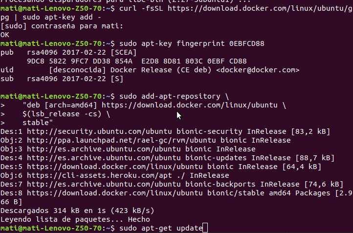
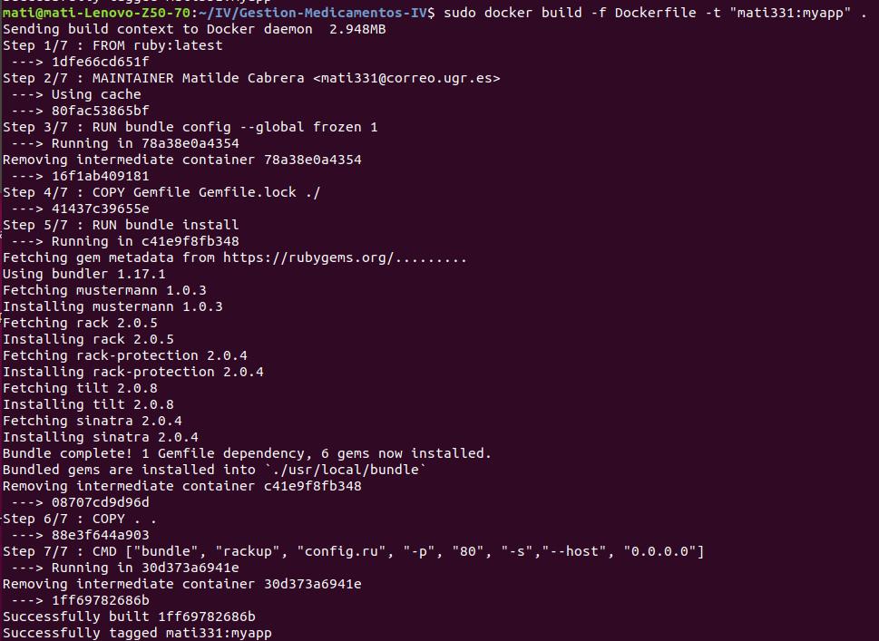
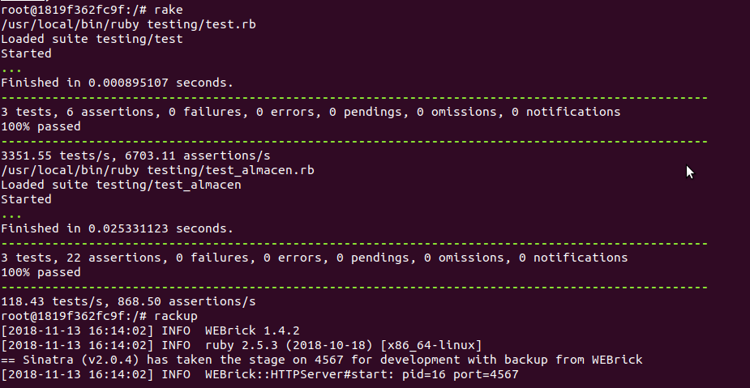

## Instalación de Docker

Seguimos la guía de [docker](https://docs.docker.com/install/linux/docker-ce/ubuntu/). O la guía del blog de [ubuntu](https://ubunlog.com/como-instalar-docker-en-ubuntu-18-04-y-derivados/)

Primero limpiamos de distribuciones antiguas de docker

añadimos la clave gpg, verificamos la huella digital, por ultimo añadimos el repositorio al sistema:

Actualizamos el sistema.

Instalamos con "sudo apt-get install docker-ce" y reiniciamos

Verificamos que se ha instalado con éxito y que está activo:

Creo un Dockerfile. En mi caso creamos un [Dockerfile para ruby](https://docs.docker.com/samples/library/ruby/#create-a-dockerfile-in-your-ruby-app-project)

			FROM ruby:2.5
			MAINTAINER Matilde Cabrera <mati331@correo.ugr.es>

			# lanzar errores si Gemfile ha sido modificado desde Gemfile.lock
			RUN bundle config --global frozen 1

			COPY Gemfile Gemfile.lock ./
			RUN bundle install

			COPY . .

			# Comando predeterminado, ejecutando la aplicación como un servicio
			CMD ["bundle", "rackup", "config.ru", "-p", "80", "-s","--host", "0.0.0.0"]

Este fichero indica a Docker las dependencias y demás herramientas que necesita nuestra aplicación tener instaladas en el contenedor para que funcione.

Hacemos la prueba en [local](https://colaboratorio.net/davidochobits/sysadmin/2018/crear-imagenes-medida-docker-dockerfile/):

Creamos el contenedor con nuestro Dockerfile:

Vemos que está la imagen creada:

Arrancamos la imagen para la prueba en local, vemos que si esta todo dentro del contenedor creado

Probamos los servicios desde el contenedor, los test con rake y la aplicación con rackup:

Ahora nos daremos de alta en Docker Hub para poder desplegar el contenedor en un Paas. Enlace a la [documentación de docker hub](https://github.com/mati3/Gestion-Medicamentos-IV/blob/master/doc/docker-hub.md)
